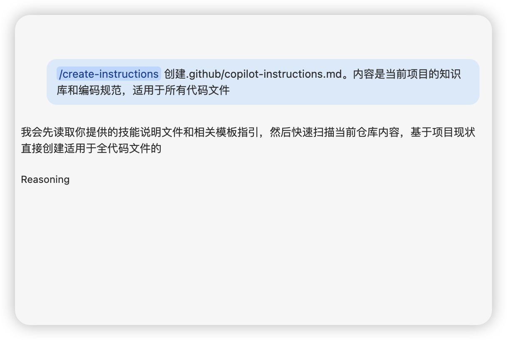

## GitHub Copilot Lab

### 什么是 Copilot 指令（Instructions）？

GitHub Copilot 的“指令”（Instructions）是一组持续生效的上下文提示，你可以把它理解为：在真正开始每一次对话或生成代码前，提前告诉 Copilot “我是谁、我偏好的风格、我当前项目的约束、请优先遵守什么规则”。它的作用是让 Copilot 自动遵循这些偏好，而不需要你每次重复说明。

**Instructions 文件不是知识库，是工作契约。它回答：我在哪、怎么跑代码、不确定时怎么办、怎么证明做完了、哪些决定不归模型做。每次模型犯错，就把错误转化为一条更具体的规则。**


### 在本 Lab 中的应用

在本实验中，我们将使用 GitHub Copilot 来：
- 创建适用于所有目标代码文件的copilot-instructions.md文件
- 创建适用于typescript文件的typescript.instructions.md文件

---

## 实验环境要求

### 软件要求
- **Node.js**: >= 22.0.0
- **npm**: >= 10.0.0
- **VS Code**: 最新版本
- **GitHub Copilot**: 已登陆

---

## Lab 步骤


#### 1.1 目标
创建相关instructions文件

#### 1.2 操作步骤

1. **创建.github文件夹**
   ```bash
   mkdir .github
   cd .github
   ```

2. **创建copilot-instructions.md**

   在 VS Code 中打开 Copilot Chat，选择Agent模式，输入以下提示词：
   ```
   /create-instructions 创建.github/copilot-instructions.md。内容是当前项目的知识库和编码规范，适用于所有代码文件
   ```
   
   这条指令会引导 Copilot 创建一个适用于所有代码文件的 instructions 文件，并自动将其内容设置为适合所有代码文件的编码规范。这个文件会被自动引用到项目中的所有代码文件中，确保你在编写任何类型的代码时，Copilot 都会优先遵循这些规范。

   
3. **创建typescript.instructions.md**

   在 VS Code 中打开 Copilot Chat，选择Agent模式，输入以下提示词：
   ```
   /create-instructions 创建.github/instructions文件夹，并创建typescript.instructions.md。内容是适合typescript的编码规范
   ```
   这条指令会引导 Copilot 创建一个专门针对 TypeScript 文件的 instructions 文件，并自动将其内容设置为适合 TypeScript 的编码规范。这个文件会被自动引用到所有 TypeScript 文件中，确保你在编写 TypeScript 代码时，Copilot 会优先遵循这些规范。

#### 最佳实践提示：


##### 一、内容编写原则

**1. 写具体可检查的规则（避免"噪声"）**

```markdown
# ❌ 噪声：模型无法执行
- 写干净的代码
- 保持简洁
- 注意性能

# ✅ 具体：5 秒内可判断是否遵守
- Server components 默认；仅在需要 state/effects 时加 "use client"
- 所有 API 输入用 zod 验证后才能碰数据库
- 不要用 `any`；用具体类型或 `unknown`
- 金额用整数分，永远不用浮点数
- 每个文件只导出一个组件
```

**2. 写"不要做什么"清单（避免"地雷"）**

```markdown
## 禁止引入（除非明确要求）
- Redux — 原因：状态已迁移到 Zustand + Server Components / 重新考虑：仅在需要离线同步时
- styled-components — 原因：样式层统一用 Tailwind / 重新考虑：永不

## 改之前必须问我
- 修改公开 API 契约
- 编辑 auth / billing / 权限逻辑
- 修改数据库 schema 或执行 migration
- 添加生产依赖
- diff 超过 500 行
```

> **关键**：每条禁止规则附上 **Reason**（为什么禁）和 **Revisit**（何时可以重新考虑）

**3. 写行为规则，不只是项目知识**

```markdown
## 工作方式
- 编码前用一句话复述目标；如果有歧义，先问
- 做满足任务的最小改动；不要顺手重构旁边的代码
- 暴露权衡和矛盾，不要默默选一个
- 不在 3+ 个地方使用前，不引入新抽象
```

**4. 写明"完成的定义"**

```markdown
## Definition of Done
完成前必须：
1. 运行 `pnpm typecheck`
2. 运行 `pnpm lint`
3. 运行改动文件的测试

## 回复格式
1. 改了哪些文件
2. 改了什么、为什么
3. 验证结果
4. 未验证的项及原因
5. 剩余风险
```

##### 二、可直接复制的骨架

```markdown
# copilot-instructions.md

## Project Overview — 一段话说清项目
## How to work — 行为规则（问、最小改动、暴露权衡）
## Coding Rules — 5 秒内可判断的具体规则
## Definition of Done — typecheck/lint/test + 汇报格式
## Do NOT introduce — 禁用库 + 原因 + 何时可重新考虑
## Stop and ask before — auth/billing/schema/生产/大改动
## Project context — 指向 docs/ 和相关文档
```

##### 三、常见反模式

| 反模式 | 说明 | 解决方式 |
| -------- | ------ | ---------- |
| **噪声** | 写了"高质量、可维护"等模型本就会尝试的废话，稀释关键规则 | 只写 Copilot 默认不会做的事 |
| **地雷** | 互相矛盾的规则，在特定场景引爆意外行为 | 用 `applyTo` 限制作用范围；定期测试边界场景 |
| **知识堆砌** | 把所有架构文档塞进一个文件 | 根文件只做路由，指向 `docs/` |

#### 1.3 验证

- copilot-instructions.md和typescript.instructions.md都被自动引用
- 如果发现typescript.instructions.md没有被引用，请确认当前typescript文件被加入了上下文
- 通过settings.json关闭instructions文件后，instructions文件不再被引用
