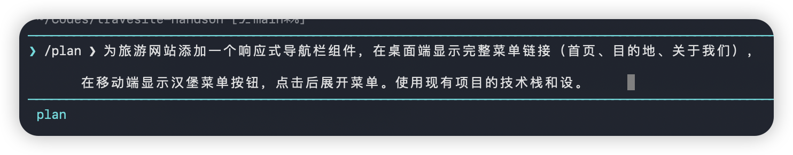
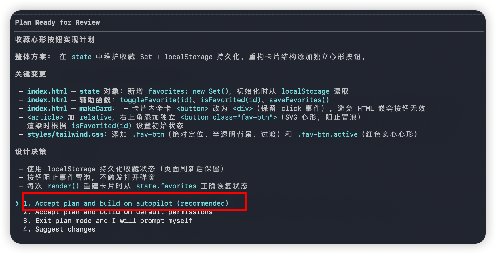
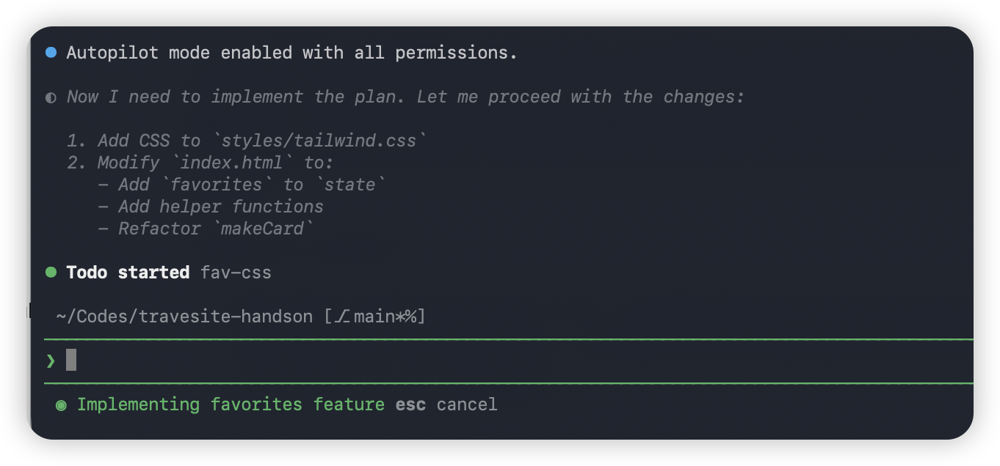
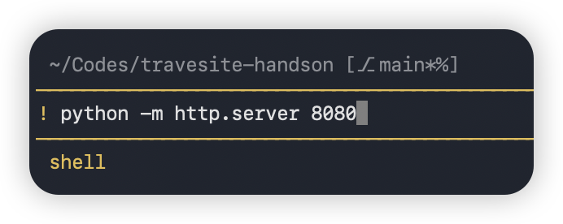

## GitHub Copilot Lab

### 什么是 Copilot CLI？

Copilot CLI 是 GitHub 提供的命令行 AI Agent，帮助你用自然语言高效驾驶终端工作流。它不仅可以生成和解释命令，还能直接读写文件、生成代码、分析错误、规划多步操作，甚至先制定计划再执行实施。

### 核心能力

| 能力 | 说明 |
|------|------|
| 自然语言交互 | 用中文或英文描述需求，CLI 自动完成 |
| 代码生成 | 根据描述创建完整的组件、模块或项目文件 |
| 代码审查 | 对已有代码进行质量分析和改进建议 |
| Plan → Autopilot | 先规划实施方案，确认后再自动执行 |
| 文件上下文 | 通过 `@文件路径` 引用已有文件作为上下文 |

### 前提条件
- 已完成 Lab 02（旅游网站项目已创建并可运行）

## 实验环境要求

### 软件要求
- **Node.js**: >= 22.0.0
- **npm**: >= 10.0.0
- **VS Code**: 最新版本
- **GitHub Copilot**: 已登陆

---

## Lab 步骤

### 第一步：安装与启动

#### 1.1 目标
安装 Copilot CLI 并完成首次登录

#### 1.2 操作步骤

1. **安装 Copilot CLI**

   在命令行中执行以下命令：
   ```bash
   npm install -g @github/copilot
   ```

2. **启动 Copilot CLI**

   在命令行导航到 Lab 02 创建的旅游网站项目文件夹，键入 `copilot` 命令启动：
   ```bash
   cd travel-site
   copilot
   ```
   首次启动时会要求信任当前文件夹并完成 GitHub 登录认证。
   

3. **查看可用命令**

   键入 `/` 查看所有支持的斜杠命令：
   

#### 1.3 验证
- Copilot CLI 成功启动，显示登录用户信息
- 输入 `/` 可以看到命令列表

---

### 第二步：基础交互 — 用自然语言生成代码

#### 2.1 目标
使用 Copilot CLI 的 Plan 模式规划方案，确认后切换到 Autopilot 模式自动实施，为旅游网站的目的地卡片添加收藏功能

#### 2.2 操作步骤

1. **使用 Plan 模式规划方案**

   在 Copilot CLI 中通过 **shift+tab** 切换到 Plan 模式，或者直接在命令行中输入 **/plan** 后输入以下提示词，CLI 进入 Plan 模式分析项目并制定计划：
   ```text
   为旅游网站的目的地卡片右上角添加一个收藏心形按钮，
   点击后心形变为红色实心表示已收藏，再次点击取消收藏。
   使用现有项目的技术栈和设计风格。
   ```
   

2. **查看并确认计划**

   CLI 会输出实施计划，包括：
   - 需要修改的文件（如目的地卡片组件）
   - 新增的状态管理逻辑
   - CSS 样式变更

   仔细查看计划内容，如有需要可以追加要求：
   ```text
   点击收藏时请添加一个心形放大的动画效果
   ```

3. **切换到 Autopilot 模式执行**
   

   确认计划无误后，同意让 CLI 开始实施。CLI 将切换到 Autopilot 模式，自动执行以下操作：
   - 在目的地卡片组件中添加心形按钮
   - 实现点击切换收藏状态的逻辑
   - 添加心形按钮的样式和动画

   

4. **验证结果**

   实施完成后，直接在Copilot CLI中启动开发服务器查看效果，使用**！**命令运行：
   ```
   !python -m http.server 8080
   ```
   

#### 2.3 验证
- CLI 成功输出实施计划并等待确认
- 确认后自动在卡片组件中添加收藏功能
- 点击心形按钮可以正常切换收藏状态

---

### 第三步：常用斜杠命令

#### 3.1 目标
掌握 Copilot CLI 的常用斜杠命令

#### 3.2 操作步骤

1. **切换 AI 模型**

   使用 `/model` 命令查看和切换可用的 AI 模型：
   ```
   /model
   ```
   根据提示选择模型（如 `claude-sonnet-4`、`gpt-4o` 等）。

2. **查看会话信息**

   使用 `/session` 命令查看当前会话状态：
   ```
   /session
   ```

3. **查看帮助**

   使用 `/help` 命令查看所有可用命令和使用说明：
   ```
   /help
   ```

4. **定时与延迟执行任务**

   使用 `/every` 命令设置定期重复执行的提示词，使用 `/after` 命令设置延迟一次性执行：
   ```
   /every 1h 运行前端测试并报告失败结果
   ```
   ```
   /after 30m 检查构建是否完成并汇总结果
   ```
   - `/every`：按指定时间间隔重复执行（如 `1h`、`30m`、`2h`）
   - `/after`：延迟指定时间后执行一次

5. **使用自定义 Agent**

   使用 `/agent` 命令查看和调用自定义 Agent。Copilot CLI 内置了多个专用 Agent：

   | Agent | 用途 |
   |-------|------|
   | Explore | 快速代码库分析，不占用主上下文 |
   | Task | 执行命令（测试、构建），成功给摘要，失败给完整输出 |
   | Code review | 审查代码变更，只报告真正的问题 |
   | Research | 跨代码库和 Web 深度调研，生成带引用的详细报告 |
   | Rubber duck | 充当建设性批评者，针对某些非琐碎任务提供反馈。由Copilot CLI自动调用|


   选择目标 Agent 后输入任务描述即可委派工作。也可以在提示词中直接引用 Agent：
   ```text
   使用 Code review agent 审查我最近的改动
   ```

6. **管理 MCP 服务器**

   使用 `/mcp` 命令查看和管理已配置的 MCP 服务器。Copilot CLI 默认内置 GitHub MCP 服务器，你可以添加更多：
   ```
   /mcp add
   ```
   按 Tab 键切换字段并填写 MCP 服务器信息，完成后按 Ctrl+S 保存。配置存储在 `~/.copilot/mcp-config.json` 中。
   ```
   /mcp
   ```
   查看当前已连接的 MCP 服务器列表。

7. **使用 Skill（技能）**

   使用 `/skill` 命令管理和调用技能。Skill 是增强 Copilot 专业能力的扩展，包含指令、脚本和资源：
   ```
   /skill
   ```
   通过 Skill，你可以为 Copilot CLI 添加特定领域的专业能力（如数据库操作、CI/CD 流水线管理等），使其更精准地完成专业任务。

#### 3.3 验证
- 成功切换 AI 模型
- 能够查看会话信息和帮助文档
- `/agent` 能列出可用的自定义 Agent
- `/mcp` 能显示已配置的 MCP 服务器

---

