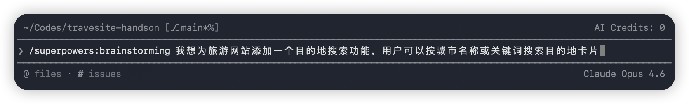
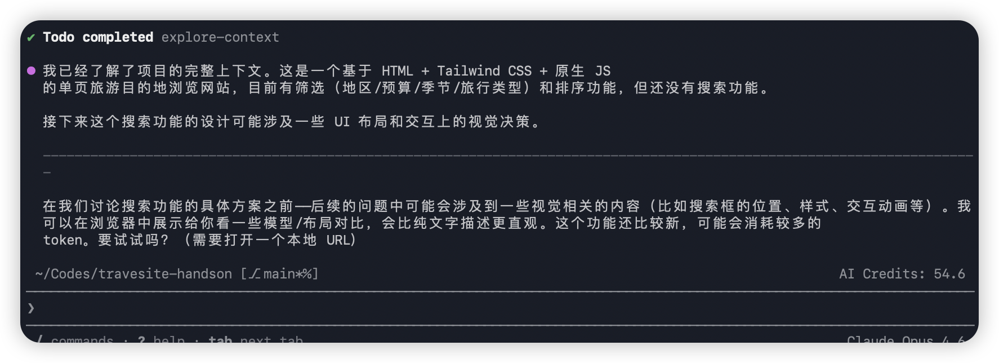
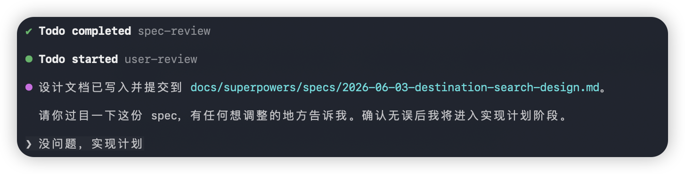
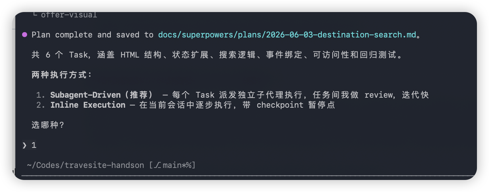

## GitHub Copilot Lab

### 什么是 Superpowers？

[Superpowers](https://github.com/obra/superpowers) 是一个开源的 Agentic Skills 框架（MIT 协议），为编码 Agent 提供一套完整的软件开发方法论。安装后，你的 Copilot CLI 将自动获得从需求探索、计划制定、并行执行到代码审查的全流程能力——**无需手动触发，Skill 会根据上下文自动激活**。

### 核心理念

| 原则 | 说明 |
|------|------|
| Test-Driven Development | 永远先写测试 |
| Systematic over Ad-hoc | 流程优先，不靠猜测 |
| Complexity Reduction | 简单性是首要目标 |
| Evidence over Claims | 验证后再宣布成功 |

### 前提条件
- 已完成 Lab 04（Copilot CLI 已安装并可正常使用）
- 已有一个可运行的项目（如 Lab 02 创建的旅游网站）

## 实验环境要求

### 软件要求
- **GitHub Copilot CLI**: 已安装并登录
- **Git**: 已配置（Superpowers 使用 git worktree）
- **Node.js**: >= 22.0.0

---

## Lab 步骤

### 第一步：安装 Superpowers 插件

#### 1.1 目标
在 Copilot CLI 中安装 Superpowers 插件

#### 1.2 操作步骤

1. **启动 Copilot CLI**

   ```bash
   cd travel-site
   copilot
   ```

2. **注册 Superpowers Marketplace**

   在 Copilot CLI 交互界面中输入：
   ```
   copilot plugin marketplace add obra/superpowers-marketplace
   ```

3. **安装 Superpowers 插件**

   ```
   copilot plugin install superpowers@superpowers-marketplace
   ```

4. **验证安装**

   安装成功后，输入任意开发任务描述（如"我想给网站添加搜索功能"），Superpowers 的 brainstorming skill 应自动触发，开始向你提问以澄清需求。

#### 1.3 验证
- 插件安装命令执行无报错
- 输入开发任务后，CLI 自动进入需求探索对话模式

---

### 第二步：了解 Superpowers Skill 体系

#### 2.1 目标
了解 Superpowers 内置的全部 Skill 及其触发时机

#### 2.2 Skill 分类一览

**测试**

| Skill | 说明 | 触发时机 |
|-------|------|----------|
| test-driven-development | RED-GREEN-REFACTOR 循环 | 实现任何功能或修复 Bug 前 |
| verification-before-completion | 确保真正修复/完成 | 宣布工作完成前 |

**调试**

| Skill | 说明 | 触发时机 |
|-------|------|----------|
| systematic-debugging | 4 阶段根因分析 | 遇到 Bug、测试失败或异常行为时 |

**协作与工作流**

| Skill | 说明 | 触发时机 |
|-------|------|----------|
| brainstorming | 苏格拉底式需求探索 | 任何创造性工作开始前 |
| writing-plans | 编写详细实施计划 | 设计确认后、写代码前 |
| executing-plans | 分批执行带检查点 | 有已写好的计划时 |
| dispatching-parallel-agents | 并行子 Agent 工作流 | 面对 2+ 个独立任务时 |
| subagent-driven-development | 快速迭代 + 双阶段审查 | 执行计划中的独立任务时 |
| requesting-code-review | 请求代码审查 | 完成任务、合并前 |
| receiving-code-review | 接收审查反馈 | 收到审查意见时 |
| using-git-worktrees | 并行开发分支 | 需要隔离环境时 |
| finishing-a-development-branch | 完成分支决策 | 所有任务完成、测试通过后 |

**元技能**

| Skill | 说明 | 触发时机 |
|-------|------|----------|
| writing-skills | 创建新 Skill | 需要编写或修改 Skill 时 |
| using-superpowers | Skill 系统入门 | 开始任何对话时 |

#### 2.3 验证
- 理解每个 Skill 的触发时机
- 知道 Skill 是自动激活的，无需手动调用

---

### 第三步：完整工作流演示 — 为旅游网站添加搜索功能

#### 3.1 目标
通过一个完整示例，体验 Superpowers 的 Brainstorming → Plan → Execute → Review 全流程

#### 3.2 操作步骤

##### Phase 1：Brainstorming（需求探索）

1. **描述需求**

   在 Copilot CLI 中输入：
   ```text
   /brainstorm 我想为旅游网站添加一个目的地搜索功能，用户可以按城市名称或关键词搜索目的地卡片
   ```
   

2. **回答 Agent 的提问**

   Superpowers 的 brainstorming skill 自动激活，Agent 会逐步向你提问：
   - 搜索是前端过滤还是需要后端 API？
   - 是否需要模糊匹配？
   - 搜索结果如何展示（高亮、排序）？
   - 是否需要搜索历史或热门推荐？

   逐一回答后，Agent 会将你的需求整理成一份**设计文档**，分段展示供你确认。
   

3. **确认设计**

   审阅设计文档，确认或修改后回复：
   ```text
   设计看起来不错，请继续
   ```

##### Phase 2：Writing Plans（制定计划）

4. **查看实施计划**

   确认设计后，writing-plans skill 自动激活。Agent 生成一份详细的实施计划，每个任务包含：
   - 任务描述（2-5 分钟粒度）
   - 需要修改/创建的文件路径
   - 完整的代码变更说明
   - 验证步骤
   

   示例计划片段：
   ```
   Task 1: 创建 SearchBar 组件
   - 文件: src/components/SearchBar.tsx
   - 测试: src/components/SearchBar.test.tsx
   - 验证: 组件渲染、输入事件触发回调

   Task 2: 实现搜索过滤逻辑
   - 文件: src/utils/searchFilter.ts
   - 测试: src/utils/searchFilter.test.ts
   - 验证: 模糊匹配、空输入、特殊字符处理
   ```

5. **确认计划**

   审阅计划后回复：
   ```text
   go
   ```

##### Phase 3：Subagent-driven Development（并行执行）

6. **观察自动执行**
   

   说 "go" 后，subagent-driven-development skill 激活：
   - Agent 为每个任务启动独立子 Agent
   - 每个子 Agent 遵循 TDD：先写失败测试 → 写最小实现 → 测试通过
   - 完成后进行双阶段审查：
     - **第一阶段**：规格符合度检查（是否按计划实现）
     - **第二阶段**：代码质量检查（命名、结构、最佳实践）

7. **处理审查反馈**

   如果子 Agent 发现问题，会自动修复并重新验证。Critical 问题会暂停执行并向你报告。

##### Phase 4：Review & Finish（审查与收尾）

8. **代码审查**

   所有任务完成后，requesting-code-review skill 自动激活：
   ```
   Agent: 所有任务已完成。以下是审查摘要：
   - ✅ 5/5 测试套件通过
   - ✅ 代码覆盖率 > 90%
   - ⚠️ 1 个建议：SearchBar 组件可添加 debounce 优化
   ```

9. **完成分支**

   finishing-a-development-branch skill 激活，提供选项：
   - Merge 到主分支
   - 创建 Pull Request
   - 保留分支继续开发
   - 放弃变更

   选择你需要的操作：
   ```text
   创建 PR
   ```

#### 3.3 验证
- Brainstorming 阶段产出了结构化的设计文档
- 实施计划包含明确的任务粒度和验证步骤
- 每个任务遵循 TDD 流程（先测试后实现）
- 最终通过代码审查并完成分支处理

---

### 第四步：单独使用 Systematic Debugging

#### 4.1 目标
体验 Superpowers 的 systematic-debugging skill 进行根因分析

#### 4.2 操作步骤

1. **描述问题**

   假设搜索功能上线后发现一个 Bug：
   ```text
   搜索 "东京" 时返回空结果，但目的地列表中确实有东京
   ```

2. **观察调试流程**

   systematic-debugging skill 自动激活，Agent 按 4 阶段流程排查：
   - **Phase 1 — 复现**：确认问题可稳定复现
   - **Phase 2 — 定位**：缩小范围（输入处理？过滤逻辑？数据源？）
   - **Phase 3 — 根因**：识别到根本原因（如编码问题或大小写匹配）
   - **Phase 4 — 修复 + 验证**：修复代码并运行测试确认

3. **确认修复**

   Agent 完成修复后，verification-before-completion skill 激活，确保：
   - 修复后的测试全部通过
   - 没有引入新的回归问题
   - 提供修复前后的对比证据

#### 4.3 验证
- Agent 按 4 阶段结构化流程排查，而非随机猜测
- 提供根因分析证据
- 修复后运行验证确认问题已解决

---

## 常用技巧

| 技巧 | 说明 |
|------|------|
| Skill 自动触发 | 无需记忆命令，描述需求即可自动匹配最佳 Skill |
| 中途干预 | 任何阶段都可以打断并给出新指示 |
| 跳过阶段 | 如果你已有设计文档，可以直接说"跳过 brainstorming，按这个设计开始规划" |
| 长时间自主运行 | Superpowers 支持 Agent 连续自主工作数小时而不偏离计划 |
| 并行分支 | 使用 git worktree 支持同时开发多个功能 |

---

## 下一步

- 返回 [Lab 04 - Copilot CLI 基础](./04.CopilotCLI.md)，复习 CLI 斜杠命令
- 进入 [Lab 07 - MCP Server](./07.MCPServer.md)，学习如何扩展 CLI 的工具能力
