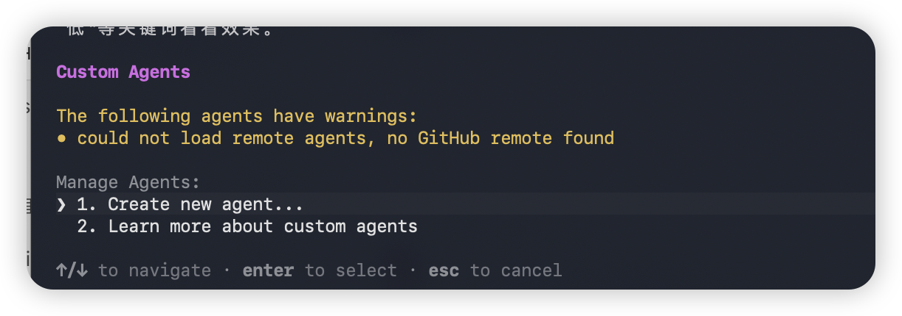
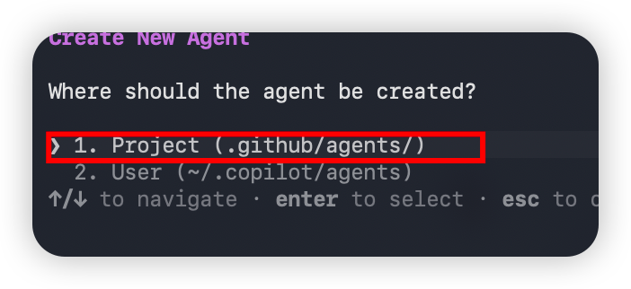
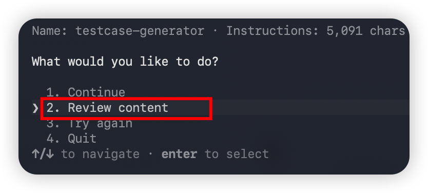
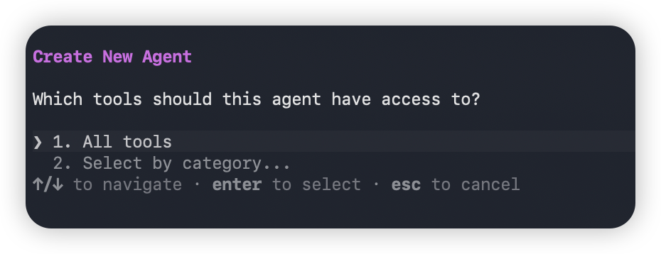
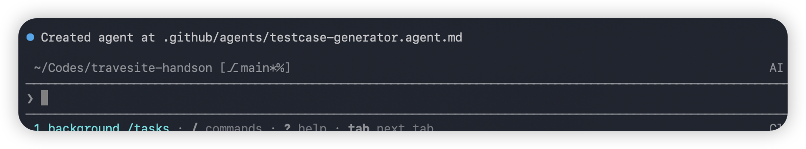
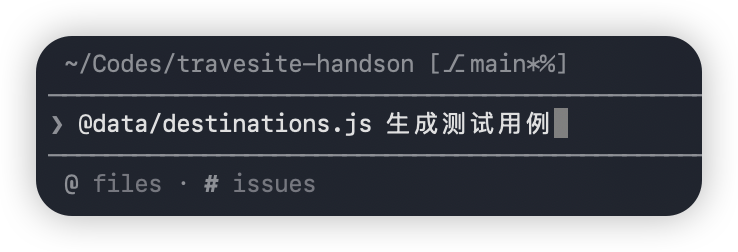
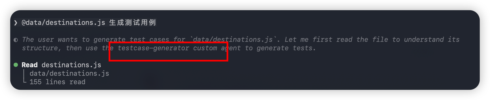

## GitHub Copilot Lab

### 什么是Custom Agent？

Custom Agent 由一组指令与工具构成，当你切换到该模式时便会自动应用。例如，一个名为 “Plan” 的模式可以包含用于生成实施计划的指令，并仅启用只读工具。通过创建自定义模式，你能够快速切换到特定配置，而无需每次手动挑选相关工具与指令。Custom Agent 通过扩展名为 .agent.md 的 Markdown 文件定义，既可以存放在工作区中供团队共享，也可以放在个人配置中，方便跨项目复用。

### 在本 Lab 中的应用

在本实验中，我们将使用 Copilot CLI 来：
- 创建可复用的Custom Agent
---

## 实验环境要求

### 软件要求
- **Node.js**: >= 22.0.0
- **npm**: >= 10.0.0
- **GitHub Copilot CLI**: 已安装并登录（`npm install -g @github/copilot`）
- **Git**: 已安装

### 前提条件

- 已完成 Copilot CLI 安装与登录
- 已有一个可运行的项目（如之前创建的旅游网站）

---

## Lab 步骤

### 使用 Copilot CLI 创建生成测试用例的 Custom Agent

#### 目标

使用 Copilot CLI 的 `/agent` 命令，快速创建一个用于生成测试用例的 Custom Agent，支持生成单元测试、集成测试和 UI 测试

#### 操作步骤

1. **启动 Copilot CLI**

   在终端中导航到你的项目目录，并启动 Copilot CLI：
   ```bash
   cd travel-site
   copilot
   ```

2. **使用 /agent 命令创建 Agent**

   在 Copilot CLI 交互界面中使用/agent 命令，选择创建一个新的 Agent，
   

   选择存储在项目目录（`.github/agents/`）下
   
   输入以下提示词：
   ```
   创建一个生成测试用例的Agent，名称为TestGenerator，它可以根据用户提供的源代码文件自动生成对应的测试文件，包括单元测试、集成测试和UI测试。支持分析代码结构、识别关键函数和边界条件，并生成覆盖正常流程、异常处理和边界情况的测试用例。
   ```

   Copilot CLI 会在 `.github/agents/` 文件夹中创建 `testgenerator.agent.md` 文件。并提示Review Content
   
  

   确认其包含合理的 Agent 配置，参考内容如下：
   ```
   ---
   description: 'You are a test case generator agent. You analyze source code files and generate comprehensive test files including unit tests, integration tests, and UI tests, covering normal flows, error handling, and edge cases.'
   name: TestGenerator
   tools: ['edit/createFile', 'edit/createDirectory', 'codebase', 'todos']
   ---
   ## Overview
   The user will provide a source code file or select code in the editor. You will analyze the code structure, identify key functions, classes, methods, API endpoints, and UI components, and generate comprehensive test cases including unit tests, integration tests, and UI tests.

   ## Steps
   1. Analyze the provided source code to understand its structure, including functions, classes, methods, API endpoints, and UI components.
   2. Identify the testing framework appropriate for the programming language and test type:
      - Unit tests: Jest, pytest, JUnit, etc.
      - Integration tests: Supertest, pytest with fixtures, Spring Boot Test, etc.
      - UI tests: Playwright, Cypress, Selenium, Testing Library, etc.
   3. Generate **unit tests** for individual functions and methods covering:
      - Normal/happy path scenarios
      - Edge cases and boundary conditions
      - Error handling and exception scenarios
      - Null/undefined/empty input handling
   4. Generate **integration tests** covering:
      - API endpoint request/response validation
      - Service-to-service interaction
      - Database operations and data flow
      - Authentication and authorization flows
   5. Generate **UI tests** covering:
      - Component rendering and display
      - User interaction flows (click, input, navigation)
      - Form validation and submission
      - Responsive layout and accessibility checks
   6. Follow testing best practices:
      - Use descriptive test names that explain the expected behavior
      - Arrange-Act-Assert (AAA) pattern
      - One assertion per test when possible
      - Mock external dependencies appropriately
      - Organize tests by type (unit/, integration/, ui/) in the test directory
   7. Create the test files in the appropriate location following the project's conventions.
   ```

   > **提示**：如果生成的内容与参考内容有所不同，可以根据实际需要在 Copilot CLI 中继续对话调整，或手动编辑文件。

4. 选择contiune, 配置Agent 允许使用的MCP工具

   

5. 完成创建

   

6. **在 Copilot CLI 中使用 TestGenerator Agent 生成测试用例**


   然后通过 `@文件路径` 引用需要测试的源代码文件，输入以下提示词：
   ```
   @src/components/DestinationCard.tsx 为这个文件生成完整的测试用例
   ```
   

   
   > 💡 **提示**：你也可以在 Copilot CLI 中使用 `@` 引用多个文件作为上下文，Agent 会综合分析后生成完整的测试套件。

#### 验证

- `.github/agents/` 文件夹中成功创建了 `testgenerator.agent.md` 文件
- Agent 配置包含合理的 description、name 和 tools
- 在 Copilot CLI 中使用 `--agent TestGenerator` 可以为源代码文件生成对应的单元测试、集成测试和 UI 测试文件

