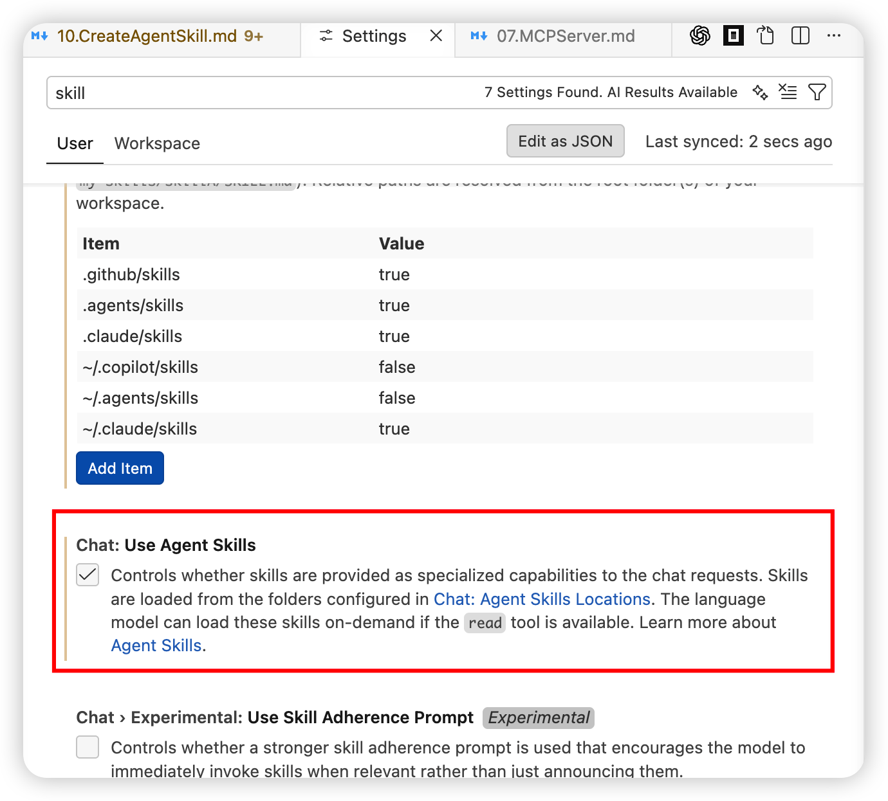

## GitHub Copilot Lab

### 什么是创建 Agent Skills？

在前面的实验中，我们学习了如何安装和使用社区提供的 Agent Skills。除此之外，你还可以**创建自己的 Agent Skills**，将特定领域的知识、检查规则和工作流封装为可复用的技能模块。

**`/create-skill`** 是 GitHub Copilot 内置的 skill-creator 技能提供的命令，它能在 Copilot Chat 中引导你完成 Skill 的完整创建流程，包括：

- **需求理解**：通过对话帮助你明确 Skill 的用途和触发场景
- **结构规划**：自动分析需要哪些脚本、参考文档和资源文件
- **文件生成**：创建规范的 Skill 目录结构和 SKILL.md 文件
- **内容编写**：生成符合最佳实践的 SKILL.md 指令内容

一个 Agent Skill 的核心结构如下：

```
skill-name/
├── SKILL.md              # 必需：技能定义文件
│   ├── YAML frontmatter  # name + description（触发条件）
│   └── Markdown 正文      # 详细指令和规则
├── scripts/              # 可选：可执行脚本
├── references/           # 可选：参考文档
└── assets/               # 可选：模板和资源文件
```

### 在本 Lab 中的应用

在本实验中，我们将：

- 了解如何使用 `/create-skill` 命令创建自定义 Agent Skill
- 创建一个名为 `frontend-review` 的技能，用于检查前端页面是否符合最佳实践
- 完善技能的检查规则，涵盖 HTML 语义化、可访问性、CSS、性能优化和响应式设计
- 测试技能的自动触发和执行效果

---

## 实验环境要求

### 软件要求

- **Node.js**: >= 22.0.0
- **npm**: >= 10.0.0
- **VS Code**: 最新版本
- **GitHub Copilot**: 已登陆
- **Agent Skills**: 已启用（参考 Lab 03）

---

## Lab 步骤

### 第一步：准备 Skills 创建环境

#### 1.1 目标

确保 Agent Skills 功能已启用，并验证 `/create-skill` 命令可用

#### 1.2 操作步骤

1. **确认 Agent Skills 已启用**

   打开 VS Code 设置（`Cmd + ,`），搜索 `agent skills`，确认 `Chat > Agent: Skills` 已勾选启用



2. **了解技能存储位置**

   创建的 Skill 可以存放在两个位置：

   | 位置 | 路径 | 适用范围 |
   |------|------|----------|
   | 个人技能目录 | `~/.copilot/skills/` | 所有项目通用 |
   | 项目技能目录 | `<项目根目录>/.github/skills/` | 仅当前项目 |

   本实验将技能创建到**项目技能目录**，以便在当前项目中使用

3. **验证 /create-skill 命令可用**

   在 VS Code 中打开 Copilot Chat，选择 Agent 模式，输入以下提示词：

   ```
   你当前支持哪些 skills？请列出所有可用技能
   ```

   在返回的技能列表中确认包含 `skill-creator`（或类似名称的技能创建工具）

> 💡 **提示**：`/create-skill` 命令是VSCode 1.110 版本以上内置的技能。如果使用IDEA，则需要手动安装此技能。

#### 1.3 验证

- [x] VS Code 设置中 Agent Skills 已启用
- [x] 了解个人技能目录和项目技能目录的区别
- [x] Copilot Chat 能识别 skill-creator 技能

---

### 第二步：使用 /create-skill 创建前端最佳实践检查 Skill

#### 2.1 目标

使用 `/create-skill` 命令创建一个用于检查前端页面最佳实践的 Agent Skill

#### 2.2 操作步骤

1. **启动 Skill 创建流程**

   在 VS Code 中打开 Copilot Chat，选择 Agent 模式，输入以下提示词：

   ```
   /create-skill 创建一个名为 frontend-review 的 Agent Skill，用于检查前端页面（HTML/CSS/JS）是否符合最佳实践。

   检查范围包括：
   1. HTML 语义化 - 是否正确使用语义化标签
   2. 可访问性（a11y） - 是否符合 WCAG 标准
   3. CSS 最佳实践 - 是否遵循 CSS 编码规范
   4. 性能优化 - 是否存在常见性能问题
   5. 响应式设计 - 是否适配多种屏幕尺寸

   Skill 存放路径：~/.copilot/skills/
   ```

2. **与 Copilot 交互完成创建**

   Copilot 会根据 skill-creator 技能的引导流程与你交互：

   - **需求确认**：Copilot 可能会询问更多细节，例如目标框架（纯 HTML 还是 React/Vue）、检查的严格程度等，按需回答即可
   - **结构规划**：Copilot 会分析并建议 Skill 的文件结构
   - **文件生成**：自动创建 `frontend-review/` 目录和 `SKILL.md` 文件

3. **观察生成的文件结构**

   创建完成后，查看生成的目录结构：

   ```bash
   ls -la ~/.copilot/skills/frontend-review/
   ```

   预期结构如下：

   ```
   frontend-review/
   ├── SKILL.md
   └── (可能包含的其他文件)
   ```

4. **查看生成的 SKILL.md**

   ```bash
   cat ~/.copilot/skills/frontend-review/SKILL.md
   ```

   确认文件包含：
   - YAML frontmatter（`name` 和 `description` 字段）
   - Markdown 正文（检查指令和规则）

#### 2.3 验证

- [x] `~/.copilot/skills/frontend-review/` 目录已创建
- [x] `SKILL.md` 文件已生成，包含 YAML frontmatter 和指令正文
- [x] `description` 字段包含触发条件描述

---

### 第三步：完善 Skill 内容

#### 3.1 目标

优化生成的 SKILL.md，确保触发条件准确、检查规则全面且实用

#### 3.2 操作步骤

1. **优化 YAML Frontmatter**

   打开 `~/.copilot/skills/frontend-review/SKILL.md`，确保 frontmatter 中的 `description` 字段足够详细，这是 Skill 自动触发的关键：

   ```yaml
   ---
   name: frontend-review
   description: >
     检查前端页面代码是否符合最佳实践，涵盖 HTML 语义化、可访问性（a11y）、
     CSS 规范、性能优化和响应式设计。当用户要求"检查前端页面"、"review my frontend"、
     "审查 HTML"、"检查可访问性"、"页面性能检查"或类似请求时使用此技能。
   ---
   ```

   > 💡 **提示**：`description` 是技能触发的唯一依据。Copilot 根据用户的提示词与 `description` 的匹配度来决定是否加载该技能，因此务必列出常见的触发短语

2. **完善检查规则正文**

   确保 SKILL.md 的 Markdown 正文包含以下检查规则分类。如果生成的内容不够完整，请补充或替换为以下内容：

   ```markdown
   # Frontend Review

   对指定的前端文件执行最佳实践检查，按以下 5 个类别逐项审查并输出发现的问题。

   ## 检查流程

   1. 读取用户指定的文件（如未指定，询问要检查的文件或目录）
   2. 按以下 5 个类别逐项检查
   3. 以 `文件名:行号 - 问题描述` 格式输出每条发现
   4. 在末尾给出总结评分（满分 100）和改进建议

   ## 检查规则

   ### 1. HTML 语义化

   - 使用语义化标签（`<header>`, `<nav>`, `<main>`, `<section>`, `<article>`, `<aside>`, `<footer>`）替代无意义的 `<div>`
   - 标题层级（`<h1>` ~ `<h6>`）应按顺序使用，不跳级
   - 列表内容使用 `<ul>`/`<ol>`/`<dl>`，不使用 `<div>` 模拟
   - 表格数据使用 `<table>`，不使用 `<div>` 布局模拟表格
   - `<button>` 用于可交互操作，`<a>` 用于导航链接，不混用
   - 每个页面应有且仅有一个 `<h1>` 标签
   - 使用 `<time>` 标签标注日期和时间

   ### 2. 可访问性（a11y）

   - 所有 `` 标签必须包含有意义的 `alt` 属性
   - 表单元素必须关联 `<label>`（使用 `for` 属性或嵌套）
   - 交互元素（按钮、链接）应有可识别的文本内容或 `aria-label`
   - 颜色对比度应符合 WCAG 2.1 AA 标准（正文至少 4.5:1）
   - 页面应可通过键盘完全操作（Tab 导航、Enter/Space 触发）
   - 使用 ARIA 角色和属性增强动态内容的可访问性
   - `<html>` 标签应包含 `lang` 属性
   - 避免仅依赖颜色传达信息

   ### 3. CSS 最佳实践

   - 避免使用 `!important`，优先通过选择器优先级解决
   - 避免过深的选择器嵌套（建议不超过 3 层）
   - 使用相对单位（`rem`, `em`, `%`）替代固定像素值
   - 避免使用内联样式（`style` 属性），将样式抽离到 CSS 文件
   - 使用 CSS 自定义属性（`--变量`）管理主题色和重复值
   - 避免使用已废弃的 CSS 属性
   - 合理使用 `box-sizing: border-box`

   ### 4. 性能优化

   - 图片应指定 `width` 和 `height` 属性，防止布局偏移（CLS）
   - 使用 `loading="lazy"` 延迟加载首屏以下的图片
   - CSS 文件放在 `<head>` 中，JS 文件使用 `defer` 或 `async` 属性
   - 避免在 `<head>` 中放置阻塞渲染的同步脚本
   - 检查是否有未使用的 CSS/JS 资源引用
   - 字体文件应使用 `font-display: swap` 避免文字闪烁
   - 避免 DOM 节点数过多（建议不超过 1500 个）

   ### 5. 响应式设计

   - 包含正确的 viewport meta 标签：`<meta name="viewport" content="width=device-width, initial-scale=1">`
   - 使用媒体查询适配不同屏幕尺寸
   - 图片使用 `max-width: 100%` 确保不超出容器
   - 避免固定宽度布局，优先使用弹性布局（Flexbox/Grid）
   - 触摸目标尺寸至少 44x44 像素
   - 文本在不同屏幕宽度下保持可读性（行宽建议 45-75 字符）

   ## 输出格式

   按以下格式输出检查结果：

   \```
   ## 检查报告：[文件名]

   ### 1. HTML 语义化
   - ✅ 通过项...
   - ❌ index.html:15 - <div> 应替换为 <nav>，此处包含导航链接
   - ❌ index.html:42 - 缺少 <main> 标签包裹主要内容

   ### 2. 可访问性（a11y）
   - ❌ index.html:23 -  缺少 alt 属性
   ...

   ### 总结
   评分：75/100
   优先修复：[列出最重要的 3 个问题]
   \```
   ```

   > 💡 **提示**：规则采用内联方式直接写入 SKILL.md，这样 Skill 是完全自包含的，无需依赖外部资源。如果规则数量较多，可以后续拆分到 `references/` 目录中

3. **保存文件**

   保存修改后的 SKILL.md 文件

#### 3.3 验证

- [x] `description` 包含完整的触发条件（中英文关键词）
- [x] 检查规则涵盖 5 大类别：HTML 语义化、可访问性、CSS、性能、响应式
- [x] 每个类别包含 5-8 条具体检查项
- [x] 定义了清晰的输出格式（文件名:行号 - 问题描述）

---

### 第四步：测试 Skill

#### 4.1 目标

使用 Lab 01 中创建的旅游网站（`travel-site`）作为测试目标，验证 `frontend-review` Skill 能正确触发并执行前端页面检查

#### 4.2 操作步骤

1. **打开 Lab 01 创建的项目**

   在 VS Code 中打开 Lab 01 创建的 `travel-site` 旅游网站项目。该项目使用 HTML + Tailwind CSS 构建，包含一个浏览目的地的页面

   > 💡 **提示**：如果尚未完成 Lab 01，请先完成 Lab 01 的实验步骤创建旅游网站项目

2. **触发 Skill 执行检查**

   在 VS Code 中打开 Copilot Chat，选择 Agent 模式，将 `travel-site` 项目中的 HTML 主页文件（如 `index.html`）添加到上下文中，输入以下提示词：

   ```
   帮我检查这个前端页面是否符合最佳实践
   ```

3. **观察执行过程**

   注意观察 Copilot 的执行流程：
   - Copilot 自动识别任务与 `frontend-review` 技能相关
   - 加载 SKILL.md 中的检查规则
   - 按 5 个类别（HTML 语义化、可访问性、CSS 最佳实践、性能优化、响应式设计）逐项检查页面代码
   - 输出格式化的检查报告，包含评分和改进建议

4. **审查检查结果**

   查看检查报告，关注以下常见问题点：

   | 类别 | 可能的发现 |
   |------|-----------|
   | HTML 语义化 | 是否使用了 `<header>`, `<nav>`, `<main>`, `<footer>` 等语义化标签 |
   | 可访问性 | 图片是否包含 `alt` 属性、表单元素是否关联 `<label>`、`<html>` 是否包含 `lang` 属性 |
   | CSS 最佳实践 | 是否存在内联样式、选择器嵌套是否过深 |
   | 性能优化 | 图片是否指定宽高、JS 脚本是否使用 `defer`/`async` |
   | 响应式设计 | 是否包含 viewport meta 标签、是否使用弹性布局 |

5. **根据建议优化页面（可选）**

   根据检查报告中的建议，可以继续在 Copilot Chat 中输入以下提示词，让 Copilot 自动修复发现的问题：

   ```
   请根据检查报告中的建议，修复页面中发现的最佳实践问题
   ```

#### 4.3 验证

- [x] Copilot 能自动识别并加载 `frontend-review` 技能
- [x] 检查报告涵盖 5 个类别
- [x] 能正确识别旅游网站页面中的最佳实践问题
- [x] 输出格式清晰，包含文件名、行号定位和改进建议
